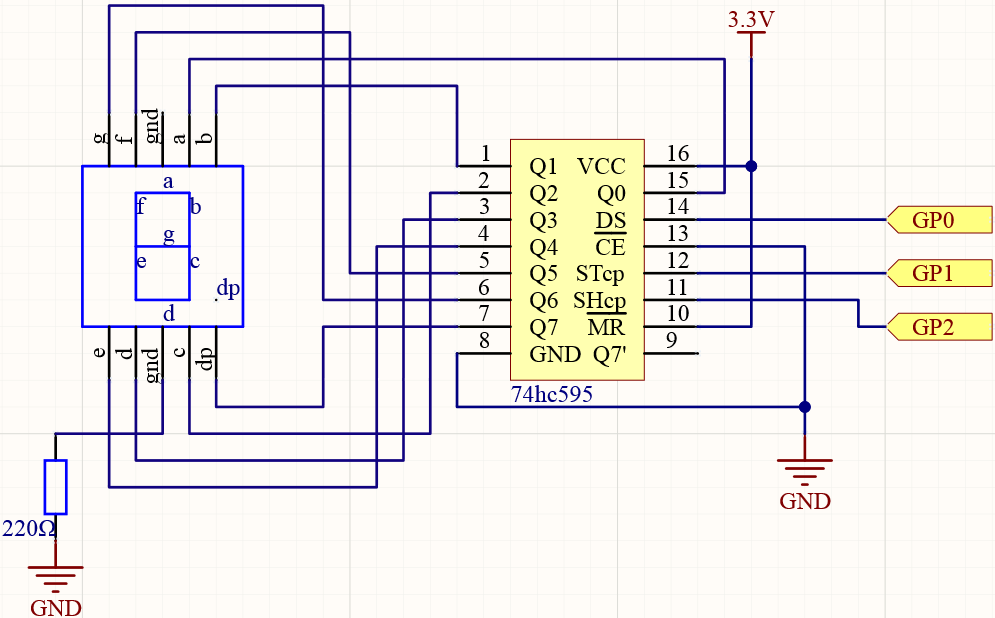
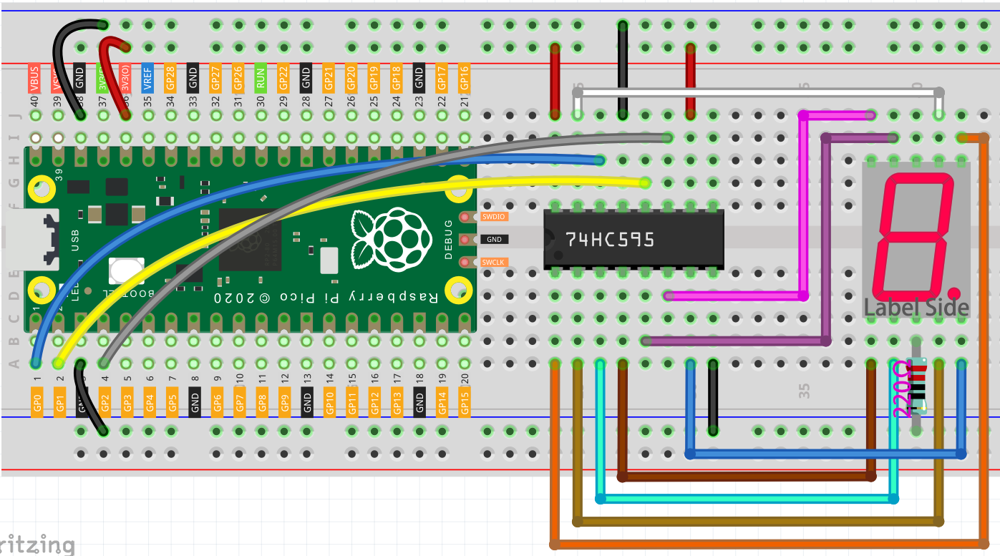

.. _74hc595_arduino:

74HC595
===========

**74HC595**

Integrated circuit (integrated circuit) is a kind of miniature electronic device or component, which is represented by the letter “IC” in the circuit.

A certain process is used to interconnect the transistors, resistors, capacitors, inductors and other components and wiring required in a circuit, fabricate on a small or several small semiconductor wafers or dielectric substrates, and then package them in a package , it has become a micro-structure with the required circuit functions; all of the components have been structured as a whole, making electronic components a big step towards micro-miniaturization, low power consumption, intelligence and high reliability.

The inventors of integrated circuits are Jack Kilby (integrated circuits based on germanium (Ge)) and Robert Norton Noyce (integrated circuits based on silicon (Si)).

This kit is equipped with an IC, 74HC595, which can greatly save the use of GPIO pins. Specifically, it can replace 8 pins for digital signal output by writing an 8-bit binary number.

* `Binary number - Wikipedia <https://en.wikipedia.org/wiki/Binary_number>`_

* :ref:`74HC595`

**LED Segment Display**

LED Segment Display can be seen everywhere in life.
For example, on an air conditioner, it can be used to display temperature; on a traffic indicator, it can be used to display a timer.

The LED Segment Display is essentially a device packaged by 8 LEDs, of which 7 strip-shaped LEDs form an "8" shape, and there is a slightly smaller dotted LED as a decimal point. These LEDs are marked as a, b, c, d, e, f, g, and dp. They have their own anode pins and share cathodes. Their pin locations are shown in the figure below.

.. image:: img/led_segment_1.png

This means that it needs to be controlled by 8 digital signals at the same time to fully work and the 74HC595 can do this.

Schematic
------------------------

Wiring
---------------------

1. Connect 3V3 and GND of Pico to the power bus of the breadboard.
#. Insert 74HC595 across the middle gap into the breadboard.
#. Connect the GP0 pin of Pico to the DS pin (pin 14) of 74HC595 with a jumper wire.
#. Connect the GP1 pin of Pico to the STcp pin (12-pin) of 74HC595.
#. Connect the GP2 pin of Pico to the SHcp pin (pin 11) of 74HC595.
#. Connect the VCC pin (16 pin) and MR pin (10 pin) on the 74HC595 to the positive power bus.
#. Connect the GND pin (8-pin) and CE pin (13-pin) on the 74HC595 to the negative power bus.
#. Insert the LED Segment Display into the breadboard, and connect a 220Ω resistor in series with the GND pin to the negative power bus.

    .. note::
        The color ring of the 220 ohm resistor is red, red, black, black and brown.

#. Follow the table below to connect the 74hc595 and LED Segment Display.

    .. list-table:: Wiring
        :widths: 15 25
        :header-rows: 1

        *   - 74HC595
            - LED Segment Display
        *   - Q0
            - a
        *   - Q1
            - b
        *   - Q2
            - c
        *   - Q3
            - d
        *   - Q4
            - e
        *   - Q5
            - f
        *   - Q6
            - g
        *   - Q7
            - dp

Code
----------

When the program runs, the 7-digit digital tube will start to display numbers from 0 to 9 in sequence.

.. raw:: html

    <iframe src=https://create.arduino.cc/editor/sunfounder01/55e1bc66-eb2f-462d-93b0-906886d75f4e/preview?embed style="height:510px;width:100%;margin:10px 0" frameborder=0></iframe>

How it works?
----------------

.. code-block:: arduino

    for(int num = 0; num <=9; num++)
    {
        digitalWrite(STcp,LOW); //ground ST_CP and hold low for as long as you are transmitting
        shiftOut(DS,SHcp,MSBFIRST,datArray[num]);
        digitalWrite(STcp,HIGH); //pull the ST_CPST_CP to save the data
        delay(500); //wait for a second
    }

``shiftOut(dataPin, clockPin, bitOrder, value)`` will make 74HC595 output 8 digital signals. It outputs the last bit of the binary number to Q0, and the output of the first bit to Q7. In other words, writing the binary number "00000001" will make Q0 output high level and Q1~Q7 output low level.
	
    * ``dataPin``: the pin on which to output each bit. Allowed data types: int.
    * ``clockPin``: the pin to toggle once the dataPin has been set to the correct value. Allowed data types: int.
    * ``bitOrder``: which order to shift out the bits; either MSBFIRST or LSBFIRST. (Most Significant Bit First, or, Least Significant Bit First).
    * ``value``: the data to shift out. Allowed data types: byte.

* `shiftOut() <https://www.arduino.cc/reference/en/language/functions/advanced-io/shiftout/>`_

Suppose that the 7-segment Display display the number "1", we need to write a high level for b, c, and write a low level for a, d, e, f, g, and dg. That is, the binary number "00000110" needs to be written. For readability, we will use hexadecimal notation as "0x06".

* `Hexadecimal <https://en.wikipedia.org/wiki/Hexadecimal>`_

* `BinaryHex Converter <https://www.binaryhexconverter.com/binary-to-hex-converter>`_

Similarly, we can also make the LED Segment Display display other numbers in the same way. The following table shows the codes corresponding to these numbers.

.. list-table:: Glyph Code
    :widths: 20 20 20
    :header-rows: 1

    *   - Numbers	
        - Binary Code
        - Hex Code  
    *   - 0	
        - 00111111	
        - 0x3f
    *   - 1	
        - 00000110	
        - 0x06
    *   - 2	
        - 01011011	
        - 0x5b
    *   - 3	
        - 01001111	
        - 0x4f
    *   - 4	
        - 01100110	
        - 0x66
    *   - 5	
        - 01101101	
        - 0x6d
    *   - 6	
        - 01111101	
        - 0x7d
    *   - 7	
        - 00000111	
        - 0x07
    *   - 8	
        - 01111111	
        - 0x7f
    *   - 9	
        - 01101111	
        - 0x6f

Write these codes into ``datArray[num]`` of ``shiftOut()`` to make the LED Segment Display display the corresponding numbers.