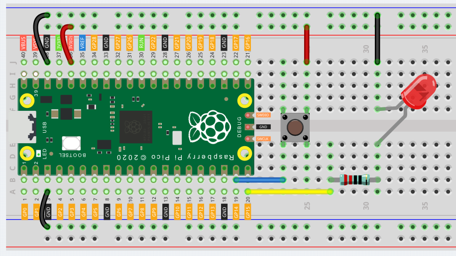

Reaction Game
==========================================================

Microcontrollers not only appear in industrial equipment, they are also used to control a large number of electronic devices in the home, including toys and games. In this chapter, we will use "button" and "LED" to build a simple reaction timing game.

The study of reaction time is called mental chronometry, it is a hard science, and it is also the basis of many games (Including the games you are about to make). Reaction time is the time that elapses between a person being presented with a stimulus and the person initiating a motor response to the stimulus, in milliseconds, the average reaction time of a person is about 200-250 milliseconds. People with short reaction time have a huge advantage in the game!

Wiring
-------------------------------

1. In general, this circuit is a combination of the circuits in the previous two lessons.
#. Confirm again that the breadboard power bus is not connected wrongly or short-circuited!

Code
----------------------------------

When the program starts, the LED will turn off within 5 to 10 seconds. You need to press the button as fast as possible, and the program will tell you what your reaction time is.

.. code-block:: python

    import machine
    import utime
    import urandom

    led = machine.Pin(15, machine.Pin.OUT)
    button = machine.Pin(14, machine.Pin.IN)

    def button_press(pin):
        button.irq(handler=None)
        rection_time = utime.ticks_diff(utime.ticks_ms(), timer_light_off)
        print("Your reaction time was " + str(rection_time) + " milliseconds!")

    led.value(1)
    utime.sleep(urandom.uniform(5, 10))
    led.value(0)
    timer_light_off = utime.ticks_ms()
    button.irq(trigger=machine.Pin.IRQ_RISING, handler=button_press)

How it works?
-----------------------------------------------

In the previous lesson, we simply read the button value. This time, we tried a flexible way of using buttons: interrupt requests, or IRQs.

For example, you are reading a book page by page, as if a program is executing a thread. At this time, someone came to you to ask a question and interrupted your reading. Then the person is executing the interrupt request: asking you to stop what you are doing, answer his questions, and then let you return to reading the book after the end.

MicroPython interrupt request also works in the same way, it allows certain operations to interrupt the main program. It is achieved through the following two statements (the highlighted 2 lines):

.. code-block:: python
    :emphasize-lines: 8,17

    import machine
    import utime
    import urandom

    led = machine.Pin(15, machine.Pin.OUT)
    button = machine.Pin(14, machine.Pin.IN)

    def button_press(pin):
        button.irq(handler=None)
        rection_time = utime.ticks_diff(utime.ticks_ms(), timer_light_off)
        print("Your reaction time was " + str(rection_time) + " milliseconds!")

    led.value(1)
    utime.sleep(urandom.uniform(5, 10))
    led.value(0)
    timer_light_off = utime.ticks_ms()
    button.irq(trigger=machine.Pin.IRQ_RISING, handler=button_press)

Here, a callback function (button_press) is first defined, which is called an interrupt handler. It will be executed when an interrupt request is triggered.
Then, set up an interrupt request in the main program, it contains two parts: ``trigger`` and ``handler``.

* In this program, the ``trigger`` is ``IRQ_RISING``, which means that the value of the pin rises from low level to high level (That is, pressing the button).
* ``handler`` is the callback function ``button_press`` we defined before. 

In this example, you will find a statement ``button.irq(handler=None)'' in the callback function, which is equivalent to canceling the interrupt.

In order to better understand the interrupt request, we change the above code to the following (Use the same circuit):

.. code-block:: python

    import machine
    import utime

    button = machine.Pin(14, machine.Pin.IN)
    count = 0

    def button_press(pin):
        print("You press the button!")
        utime.sleep(1)        

    button.irq(trigger=machine.Pin.IRQ_RISING, handler=button_press)

    while True:
        count+=1
        print(count)
        utime.sleep(1)

When the program runs, it will start counting and print the numbers in the shell. When we press the button, it will stop counting and enter the callback function to print "You press the button!".

Go back to the original example. We need to make the LED turn off in a random time of 5 to 10 seconds, which is achieved by the following two lines:

.. code-block:: python
    :emphasize-lines: 3,14

    import machine
    import utime
    import urandom

    led = machine.Pin(15, machine.Pin.OUT)
    button = machine.Pin(14, machine.Pin.IN)

    def button_press(pin):
        button.irq(handler=None)
        rection_time = utime.ticks_diff(utime.ticks_ms(), timer_light_off)
        print("Your reaction time was " + str(rection_time) + " milliseconds!")

    led.value(1)
    utime.sleep(urandom.uniform(5, 10))
    led.value(0)
    timer_light_off = utime.ticks_ms()
    button.irq(trigger=machine.Pin.IRQ_RISING, handler=button_press)
    
The ``urandom`` library is loaded here. Use the ``urandom.uniform(5,10)'' function to generate a random number, the ‘uniform’ part referring to a uniform distribution between those two numbers.

If needed, try running the following example of random number generation:

.. code-block:: python

    import machine
    import utime
    import urandom

    while True:
        print(urandom.uniform(1, 20))
        utime.sleep(1)

The last two statements you need to understand are ``utime.ticks_ms()`` and ``utime.ticks_diff()``.

.. code-block:: python
    :emphasize-lines: 10,16

    import machine
    import utime
    import urandom

    led = machine.Pin(15, machine.Pin.OUT)
    button = machine.Pin(14, machine.Pin.IN)

    def button_press(pin):
        button.irq(handler=None)
        rection_time = utime.ticks_diff(utime.ticks_ms(), timer_light_off)
        print("Your reaction time was " + str(rection_time) + " milliseconds!")

    led.value(1)
    utime.sleep(urandom.uniform(5, 10))
    led.value(0)
    timer_light_off = utime.ticks_ms()
    button.irq(trigger=machine.Pin.IRQ_RISING, handler=button_press)

* The ``utime.ticks_ms()`` function will output the number of milliseconds that have passed since the ``utime`` library started counting and store it in the variable ``timer_light_off``.
* ``utime.ticks_diff()'' is used to output the time difference between two time nodes. The two time nodes in this function are ``utime.ticks_ms()``, the current program time (press the button) and the reference time (light off) stored in the variable ``timer_light_off``.
  
These two functions are usually used together to calculate the execution time of the program. Here we use it to calculate the time from when the light turns off to when the button is pressed.

Finally, this time will be printed out.

.. code-block:: python

    print("Your reaction time was " + str(rection_time) + " milliseconds!")

Also see the reference here:

* `machine.Pin <https://docs.micropython.org/en/latest/library/machine.Pin.html>`_
* `urandom <https://www.sutron.com/micropython/html/library/urandom.html>`_
* `utime <https://docs.micropython.org/en/latest/library/utime.html>`_

What more?
------------------------
Playing with your friends will be more fun, why not add buttons and see who can press the buttons the fastest?

Please try it.

.. image:: img/wiring_reaction_game_2.png

.. code-block:: python

    import machine
    import utime
    import urandom

    led = machine.Pin(15, machine.Pin.OUT)
    left_button = machine.Pin(14, machine.Pin.IN)
    right_button = machine.Pin(16, machine.Pin.IN)

    def button_press(pin):
        left_button.irq(handler=None)
        right_button.irq(handler=None)
        rection_time = utime.ticks_diff(utime.ticks_ms(), timer_light_off)
        if pin == left_button:
            print("Left player is winner!")
        elif pin == right_button:
            print("Right player is winner!")
        print("Your reaction time was " + str(rection_time) + " milliseconds!")

    led.value(1)
    utime.sleep(urandom.uniform(5, 10))
    led.value(0)
    timer_light_off = utime.ticks_ms()    
    right_button.irq(trigger=machine.Pin.IRQ_RISING, handler=button_press)
    left_button.irq(trigger=machine.Pin.IRQ_RISING, handler=button_press)
    

