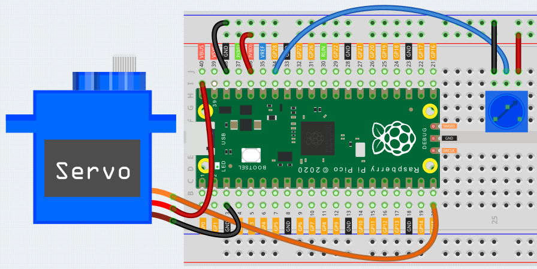

Turn the Knob
============================

In the previous chapters, we have used the digital input on the Pico.
For example, a button can change the pin from low level (off) to high level (on). This is a binary working state.

However, Pico can receive another type of input signal: analog input.
It can be in any state from fully closed to fully open, and has a range of possible values.
The analog input allows the microcontroller to sense the light intensity, sound intensity, temperature, humidity, etc. of the physical world.

Usually, a microcontroller needs an additional hardware to implement analog input-the analogue-to-digital converter (ADC).
But Pico itself has a built-in ADC for us to use directly.

.. image:: img/pin_pic3.png

Pico has three GPIO pins that can use analog input, GP26, GP27, GP28. That is, analog channels 0, 1, and 2.
In addition, there is a fourth analog channel, which is connected to the built-in temperature sensor and will not be introduced here.

In this chapter, we use potentiometer to try to read analog values.

Wiring
----------------------------

.. image:: img/wiring_turn_the_knob.png

1. Connect 3V3 and GND of Pico to the power bus of the breadboard.
#. Insert the potentiometer into the breadboard, its three pins should be in different rows.
#. Use jumpers to connect the pins on both sides of the potentiometer to the positive and negative power bus.
#. Connect the middle pin of the potentiometer to GP28 with a jumper wire.
#. Connect the anode of the led to the GP15 pin through a 220Ω resistor, and connect the cathode to the negative power bus.

Code
--------------------------------

.. code-block:: python

    import machine
    import utime

    potentiometer = machine.ADC(28)
    led = machine.PWM(machine.Pin(15))
    led.freq(1000)

    while True:
        value=potentiometer.read_u16()
        print(value)
        led.duty_u16(value)
        utime.sleep_ms(200)

        When the program is running, we can see the analog value currently read by the GP28 pin in the shell. Turn the knob, and the value will change from 0 to 65535.
        At the same time, the brightness of the LED will increase as the analog value increases.

What more?
------------------------
Let's use the potentiometer knob to make the servo sway left and right!

.. code-block:: python

    import machine
    import utime

    potentiometer = machine.ADC(28)    
    servo = machine.PWM(machine.Pin(15))
    servo.freq(50)

    def interval_mapping(x, in_min, in_max, out_min, out_max):
        return (x - in_min) * (out_max - out_min) / (in_max - in_min) + out_min

    def servo_write(pin,angle):
        pulse_width=interval_mapping(angle, 0, 180, 0.5,2.5)
        duty=int(interval_mapping(pulse_width, 0, 20, 0,65535))
        pin.duty_u16(duty)

    while True:
        value=potentiometer.read_u16()
        angle=interval_mapping(value,0,65535,0,180)
        servo_write(servo,angle)
        utime.sleep_ms(200)

