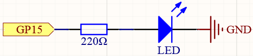

.. _hello_led_arduino:

Hello LED
===============

Just as printing “Hello, world!” is the first step in learning programming, letting the LED light up is the traditional entry to learning physical programming.

To use extended electronic components, a solderless breadboard will be the most powerful partner for novice users.

The breadboard is a rectangular plastic plate with a bunch of small holes in it. These holes allow us to easily insert electronic components and build electronic circuits. The breadboard does not permanently fix the electronic components, which makes it easy for us to repair the circuit and start over when we make a mistake.

Schematic
-----------

Wiring
----------------

.. image:: img/wiring_hello_breadboard.png

Let us follow the direction of the current to build the circuit!

1. Here we use the electrical signal from the GP15 pin of the Pico board to make the LED work, and the circuit starts from here.
#. The current needs to pass through a 220 ohm resistor (used to protect the LED). Insert one end (either end) of the resistor into the same row as the Pico GP15 pin (row 20 in my circuit), and insert the other end into the free row of the breadboard (row 24 in my circuit).

    .. note::
        The color ring of the 220 ohm resistor is red, red, black, black and brown.

#. Pick up the LED, you will see that one of its leads is longer than the other. Insert the longer lead into the same row as the end of the resistor, and connect the shorter lead across the middle gap of the breadboard to the same row.
    
    .. note::
        The longer lead is known as the anode, and represents the positive side of the circuit; the shorter lead is the cathode, and represents the negative side. 

        The anode needs to be connected to the GPIO pin through a resistor; the cathode needs to be connected to the GND pin.

#. Insert the male-to-male (M2M) jumper wire into the same row as the LED short pin, and then connect it to the negative power bus of the breadboard.
#. Use a jumper to connect the negative power bus to the GND pin of Pico.

Code
-------------

* You can click the **Download Sketch** icon to download the code and open it with the desktop Arduino IDE.
* Or **OPEN IN WEB EDITOR**.
* Then upload the code to your Pico(:ref:`Setup the Raspberry Pi Pico`).

.. raw:: html

    <iframe src=https://create.arduino.cc/editor/sunfounder01/69bd7223-ae0b-4fa5-b0f0-cc358f9982a9/preview?embed style="height:510px;width:100%;margin:10px 0" frameborder=0></iframe>
    
How it works?
------------------

Here, we connect the LED to the GPIO15, so we define a variable ``ledPin`` to represent GPIO15. 
You could also just replace all the ``ledPin`` pins in the code with 15, but if you were to replace 15 with other pins you would have to modify 15 one by one, which would add a lot of work.

.. code-block:: arduino

    #define ledPin 15
    
Now, you need to set the pin to OUTPUT mode in the ``setup()`` function.

.. code-block:: arduino

    pinMode(ledPin, OUTPUT);

* `pinMode() <https://www.arduino.cc/reference/en/language/functions/digital-io/pinmode/>`_

The above code has "set" the pin, but it will not light up the LED. Here, we use the `digitalWrite() <https://www.arduino.cc/reference/en/language/functions/digital-io/digitalwrite/>`_ function to assign a high level signal to ``ledpin``, which will cause a voltage difference between the LED pins, causing the LED to light up.

.. code-block:: arduino

    digitalWrite(ledPin, HIGH);

If the level signal is changed to LOW, the ledPin's signal will be returned to 0 V to turn LED off.

.. code-block:: arduino

    digitalWrite(ledPin, LOW);

* `digitalWrite() <https://www.arduino.cc/reference/en/language/functions/digital-io/digitalwrite/>`_

An interval between on and off is required to allow people to see the change, so we use a ``delay(1000)`` code to let the controller do nothing for 1000 ms.

.. code-block:: arduino

    delay(1000);
