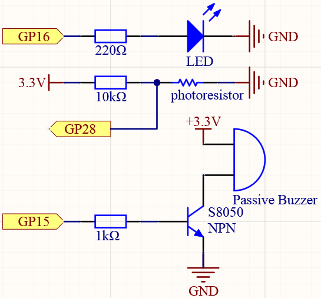
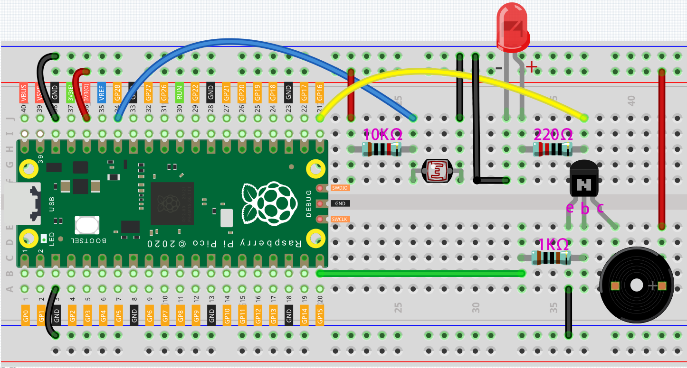

.. _light_theremin_arduino:

Light Theremin
================

Theremin is an electronic musical instrument that does not require physical contact. It produces different tones by sensing the position of the player's hand.

The instrument's controlling section usually consists of two metal antennas that sense the relative position of the thereminist's hands and control oscillators for frequency with one hand, and amplitude (volume) with the other. The electric signals from the theremin are amplified and sent to a loudspeaker.

We cannot reproduce the same instrument through Pico, but we can use photoresistor and passive buzzer to achieve similar gameplay.

* `Theremin - Wikipedia <https://en.wikipedia.org/wiki/Theremin>`_

Schematic
-----------

Wiring
--------------------

#. Connect 3V3 and GND of Pico to the power bus of the breadboard.
#. Connect one lead of the photoresistor to the GP28 pin, then connect the same lead to the positive power bus with a 10K ohm resistor.
#. Connect another lead of photoresistor to the negative power bus.
#. Insert the LED into the breadboard, connect its anode pin to the GP16 in series with a 220Ω resistor, and connect its cathode pin to the negative power bus.
#. Insert the passive buzzer and S8050 transistor into the breadboard. The anode pin of the buzzer is connected to the positive power bus, the cathode pin is connected to the **collector** lead of the transistor, and the **base** lead of the transistor is connected to the GP15 pin through a 1kΩ resistor. **emitter** lead is connected to the negative power bus.

.. note::
    * The color ring of the 220Ω resistor is red, red, black, black and brown.
    * The color ring of the 10kΩ resistor is brown, black, black, red and brown.

Code
-------

.. raw:: html

    <iframe src=https://create.arduino.cc/editor/sunfounder01/d419e245-69da-43fb-9f95-d8f3c1292319/preview?embed style="height:510px;width:100%;margin:10px 0" frameborder=0></iframe>

When the program runs, the LED will light up, and we will have one seconds to calibrate the detection range of the photoresistor. This is because we may be in a different light environment each time we use it (e.g. the light intensity is different between midday and dusk).

At this time, we need to swing our hands up and down on top of the photoresistor, and the movement range of the hand will be calibrated to the playing range of this instrument.

After one seconds, the LED will go out and we can wave our hands on the photoresistor to play.

How it works?
----------------

.. code-block:: arduino
    
    /* calibrate the photoresistor max & min values */
    previousMillis = millis();
    digitalWrite(ledPin, HIGH);
    while (millis() - previousMillis <= interval) {
      sensorValue = analogRead(photocellPin);
      if (sensorValue > lightHigh) {
        lightHigh = sensorValue;
      }
      if (sensorValue < lightLow) {
        lightLow = sensorValue;
      }
    }
    digitalWrite(ledPin, LOW);

Set up a calibration process in ``setup()``, using ``millis()`` for timing with an interval of 1s (``interval = 1000``). During this second, wave a hand around the photoresistor, the maximum and minimum values ​​of the detected light are recorded and assigned to ``lightHigh`` and ``lightLow`` respectively.

* `millis() <https://www.arduino.cc/reference/en/language/functions/time/millis/>`_

.. code-block:: arduino

  sensorValue = analogRead(photocellPin); //read the value of A0
  pitch = map(sensorValue, lightLow, lightHigh, 50, 6000);
  if (pitch > 50) {
    tone(buzzerPin, pitch, 20);
  }

Read the value of the photocell resistor to ``sensorValue`` and map it from the small range to the large range to be used to control the frequency of the buzzer. For a detailed explanation of ``map()``, please refer to the course :ref:`measure_light_arduino`.

  .. code-block:: arduino

      tone(buzzerPin, pitch, 20)
    
  This function can make the buzzer sound, the frequency is ``pitch``, and the duration is 20 milliseconds.

