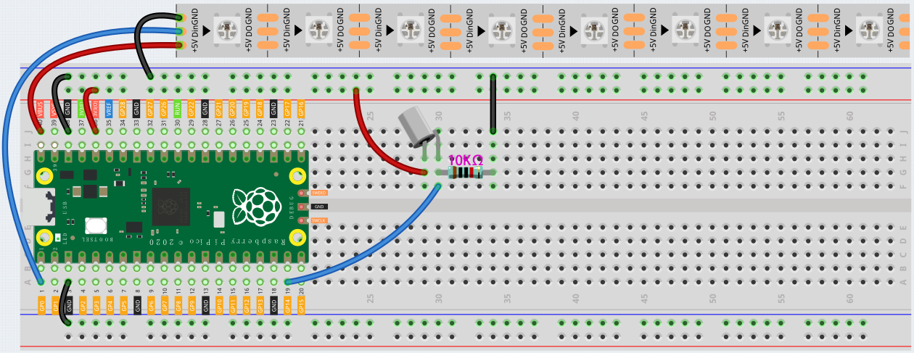

.. _ws2812_flow_leds_arduino:

Flow LEDs
=============

In this kit is equipped with a WS2812 RGB 8 LEDs Strip, which can display colorful colors and each LED can be controlled independently.

Here, a tilt switch is used to control the flow direction of LED on the WS2812 Strip.

Schematic
------------------------

.. image:: img/WS2812_Flow.png
    :width: 600

Wiring
----------

Code
-------

After the code runs, when the tilt switch is placed vertically, the LED on the WS2812 Strip will light up from one side, and when it is placed horizontally, the WS2812 will light up from the other side.

.. raw:: html

    <iframe src=https://create.arduino.cc/editor/sunfounder01/320a0840-d0ad-4dd6-aacd-42df3b87da39/preview?embed style="height:510px;width:100%;margin:10px 0" frameborder=0></iframe>

How it works?
----------------

.. code-block:: arduino

    #include <Adafruit_NeoPixel.h>
	
    Adafruit_NeoPixel pixels(NUMPIXELS, PIN, NEO_GRB + NEO_KHZ800);

Import the ``Adafruit_NeoPixel.h`` library and create a object ``pixel`` to control WS2812.
The three parameters ``NUMPIXELS``, ``PIN``, ``NEO_GRB + NEO_KHZ800`` are used to declare the number of LED pixels, pin number and Pixel type flags.

.. note::
    To use this library, open the **Library Manager** in the Arduino IDE and install it from there.

    **Sketch** -> **Include Library** -> **Manager Libraries**

    .. image:: img/neopixel.png

.. code-block:: arduino

    pixels.begin()

This statement is used to initialize the NeoPixel strip object.

.. code-block:: arduino

    if (ledIndex < 0) {
      ledIndex = NUMPIXELS-1;
    }
    else if (ledIndex >= NUMPIXELS) {
      ledIndex = 0;
    }

Limit the value of ``ledIndex`` to 0 to ``NUMPIXELS``. When it is greater than this range, ``ledIndex`` is re-assigned to 0. When it is less than this range, ledIndex is re-assigned to ``NUMPIXELS-1``.

.. code-block:: arduino

    pixels.clear()

This statement set pixel colors to 0 (off).

.. code-block:: arduino

    pixels.setPixelColor(ledIndex, pixels.Color(100, 50, 0))

This statement is used to set the color of the WS2812 Strip, the first parameter refers to the serial number of the WS2812 Strip, and the second parameter represents the color.

.. code-block:: arduino

    pixels.show()
	
Show the effect on WS2812 Strip.

    