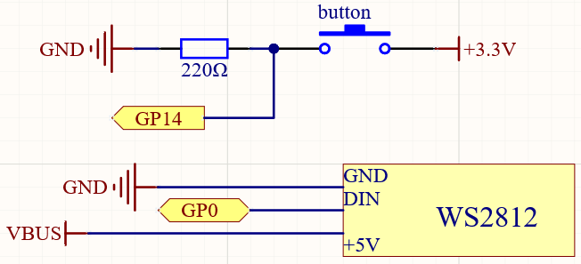

.. _ws2812_multimode_arduino:

WS2812 Strip Multi-Mode
================================

In addition to having the WS2812 Strip display one color or one LED at a time, you can control 8 LEDs at a time and have them each display a different color.

Schematic
------------------------

Wiring
----------

.. image:: img/WS2812_Mode2_fritz.png

Code
-------

After the program is running, every time you press the switch, WS2812 will change a mode, there are four modes in total.

.. raw:: html

    <iframe src=https://create.arduino.cc/editor/sunfounder01/07f55303-59f2-4aa2-897a-88e7ddab9570/preview?embed style="height:510px;width:100%;margin:10px 0" frameborder=0></iframe>

How it works?
----------------

.. code-block:: arduino

    Adafruit_NeoPixel strip(PIXEL_COUNT, PIXEL_PIN, NEO_GRB + NEO_KHZ800)

Create object ``strip`` to control ws2812 and declare the number of LED pixels, pin number and Pixel type flags.

.. code-block:: arduino

    boolean lastButtonState = LOW

Set the initial state of the button to LOW, which means the button is not pressed.

.. code-block:: arduino

  boolean currentButtonState = digitalRead(BUTTON_PIN);

  // Check if button press.
  if ((currentButtonState == LOW) && (lastButtonState == HIGH)) {
    // Short delay to debounce button.
    delay(20);

    mode = (mode + 1) % 4;
    switch (mode) {          // Start the new animation...
      case 0:
        colorWipe(strip.Color(  255,   127,   0), 50);
        break;
      case 1:
        theaterChase(strip.Color(  0,   127, 127), 100);
        break;
      case 2:
        rainbow(10);
        break;
      case 3:
        theaterChaseRainbow(100);
        break;
  }

Firstly, the value of the button is read, and when the button is detected from pressed to released, it enters into the mode selection. There are 4 modes:

* ``colorWipe()``: From the left ( wired side ) to the right, light up one led every 50ms, after all light up, wait 500ms, then from left to right, turn off one led every 50ms(variable ``wait``), until all off.
* ``theaterChase()``: First light up the WS2812 Strip on the 1st (wired side), 4, 7 position of the LED, wait 50ms after extinguishing; then light up 2, 5, 8 of the led, wait 50ms after extinguishing; finally light up 3, 6 of the led, wait 50ms after extinguishing. The whole process is cycled 10 times, due to the short interval thus achieving the effect of flow.
* ``rainbow()``: Different colors are displayed on 8 LEDs, and then these 8 colors flow from right to left (wired side), flowing 3 times and then stopping.
* ``theaterChaseRainbow()``: Add flow effect to ``rainbow()``.