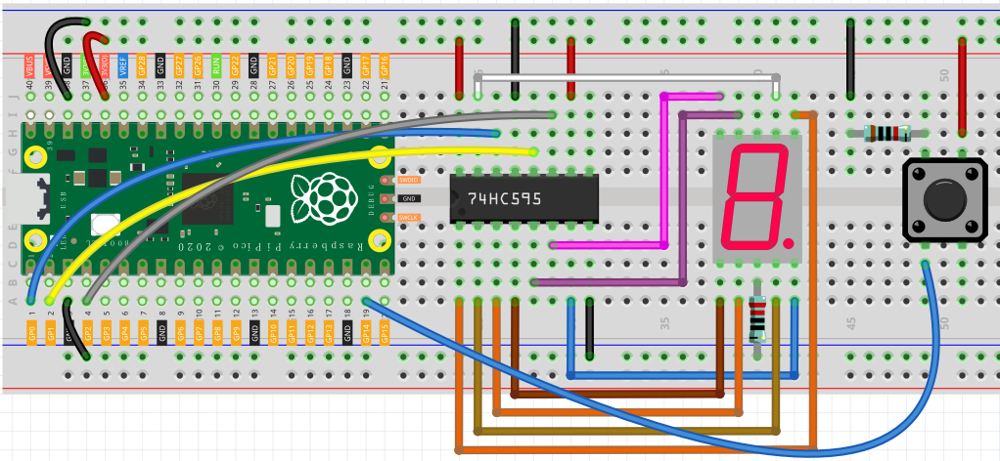

.. _digital_dice_arduino:

Digital Dice
==============

In the last project, we learned how to use 74HC595 to light up the LED Segment Display. Of course, we can expand on this basis to make it more interesting.

Here, we will add a button to the previous project to make a digital dice. When the button is pressed, the 7 segment display will randomly show 1-6.

Schematic
------------------------

.. image:: img/Digital_Dice.png

Wiring
----------

Code
-------

When the program starts running, every time you press the button, the digital tube will randomly display a number from 1 to 6.

.. raw:: html

    <iframe src=https://create.arduino.cc/editor/sunfounder01/07b0d1ff-01da-4e6c-9aaf-c6fa8527c9f4/preview?embed style="height:510px;width:100%;margin:10px 0" frameborder=0></iframe>

How it works?
----------------

.. code-block:: arduino

    SEGCODE = [0x3f,0x06,0x5b,0x4f,0x66,0x6d,0x7d,0x07,0x7f,0x6f]

First, define a hexadecimal array to represent the number from 0 to 9 displayed by the 7 segment display.

.. code-block:: arduino

    if (digitalRead(button)==HIGH){
        dice = random(1,7);
    }

When the value of the button is HIGH, i.e. the key has been pressed, the ``random()`` function is called to generate a random number from 1 to 6 to be stored in the variable ``dice``.

* `random <https://www.arduino.cc/reference/en/language/functions/random-numbers/random/>`_

The following table shows the codes corresponding to these numbers.

.. list-table:: Glyph Code
    :widths: 20 20 20
    :header-rows: 1

    *   - Numbers	
        - Binary Code
        - Hex Code  
    *   - 0	
        - 00111111	
        - 0x3f
    *   - 1	
        - 00000110	
        - 0x06
    *   - 2	
        - 01011011	
        - 0x5b
    *   - 3	
        - 01001111	
        - 0x4f
    *   - 4	
        - 01100110	
        - 0x66
    *   - 5	
        - 01101101	
        - 0x6d
    *   - 6	
        - 01111101	
        - 0x7d
    *   - 7	
        - 00000111	
        - 0x07
    *   - 8	
        - 01111111	
        - 0x7f
    *   - 9	
        - 01101111	
        - 0x6f
		
``dice = random(1,7)`` the random function generates pseudo-random numbers from 1 to 6(Exclude 7).

.. code-block:: arduino

    digitalWrite(STcp,LOW); //ground ST_CP and hold low for as long as you are transmitting
    shiftOut(DS,SHcp,MSBFIRST,datArray[dice]);
    digitalWrite(STcp,HIGH); //pull the ST_CPST_CP to save the data
    delay(100); //wait for a second

Display the corresponding number on the 7 segment display via ``shiftOut()`` function.
