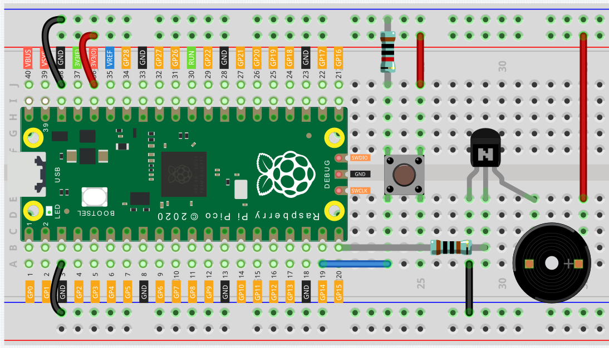

Doorbell
================

A buzzer is a great tool in your experiments whenever you want to make some sounds. In this project, we will learn how to drive a passive buzzer to build a simple doorbell.

Two types of buzzers are included in the kit. We need to use passive buzzer. Turn them around, the one with exposed PCB is we want.

.. image:: img/buzzer.png

The buzzer needs to use a transistor when working, here we use S8050.

.. image:: img/npn_pnp.png
  :width: 300

* :ref:`Transistor`
* :ref:`Button`

Schematic
-----------

.. image:: img/Door_Bell.png

Wiring
-------------------------

* The basic function of the triode is to amplify and switch. In this circuit, the switch function of the NPN triode is used to drive the buzzer. When a high-level signal is given to the base of the NPN transistor, the transistor is turned on and the buzzer can emit a sound.
* When a pin is floating, its level may be high or low, so we connect a 10K resistor in the upper left corner of the button to keep the button in a low state when it is not pressed. You can also try to remove this 10K resistor, and you will find that even if it is not pressed, the buzzer may sound.

.. _door_bell:

Code
----------

After uploading the code, when you press the button, you can hear a 7-note melody.

.. raw:: html

  <iframe src=https://create.arduino.cc/editor/sunfounder01/36c926de-b49d-4773-a301-efcfd71da210/preview?embed style="height:510px;width:100%;margin:10px 0" frameborder=0></iframe>

How it works?
---------------

.. code-block:: arduino

  #include "pitches.h"

The code uses an extra file, ``pitches.h``. This file contains all the pitch values for typical notes. For example, NOTE_C4 is middle C. NOTE_FS4 is F sharp, and so forth. This note table was originally written by Brett Hagman, on whose work the tone() command was based. You may find it useful whenever you want to make musical notes.

.. note::
  There is already a pitches.h file in this sample program. If you cannot find pitches.h after downloading or opening the code, you can just install one manually.
  
  Click the button below the serial monitor icon and select "New Tab", or use Ctrl+Shift+N.

  .. image:: img/new.png

  Then paste from :ref:`door_bell` and save it as ``pitches.h``:

.. code-block:: arduino

  int melody[] = {NOTE_C4, NOTE_G3, NOTE_G3, NOTE_A3, NOTE_G3, 0, NOTE_B3, NOTE_C4};

  int buttonPin = 14;
  
  //note durations. 4=quarter note / 8=eighth note
  int noteDurations[] = {4, 8, 8, 4, 4, 4, 4, 4};

The array ``melody[]`` stores 7 notes, and ``noteDurations[]`` is the duration corresponding to these notes, 4=quarter note, 8=eighth note.

* `Quarter note <https://en.wikipedia.org/wiki/Quarter_note>`_
* `Eighth note <https://en.wikipedia.org/wiki/Eighth_note>`_

.. code-block:: arduino

  int buttonState = digitalRead(buttonPin);   //read the input pin
    //if the button is pressed
    if (buttonState == 1) {
      //iterate over the notes of the melody
      for (int i = 0; i < 8; i++) {

        // to calculate the note duration, take one second divided by the note type.
        //e.g. quarter note = 1000 / 4, eighth note = 1000/8, etc.
        int noteDuration = 1000 / noteDurations [i];
        tone(15, melody [i], noteDuration);
        //to distinguish the notes, set a minimum time between them
        //the note's duration +30% seems to work well
        int pauseBetweenNotes = noteDuration * 1.30;
        delay(pauseBetweenNotes);
      }
    }

First read the value of the button in loop(). When the button is pressed, ``buttonState`` will be equal to 1.

In the for() statement, a `tone() <https://www.arduino.cc/reference/en/language/functions/advanced-io/tone/>`_ is used to let the buzzer play one note at a time, and then after 8 times, the buzzer can play the notes in the array melody[] one by one.

.. code-block:: arduino

  tone(15, melody [i], noteDuration);

* **15**: The pin on which to generate the tone (the buzzer pin).
* **melody [i]**: The frequency of the tone in hertz.
* **noteDuration**: The duration of the tone in milliseconds (optional).

.. code-block:: arduino

  else
  {
    noTone(15);    //if the button is released, stop the tone playing.
  }

Stops the generation of a square wave triggered by tone(). Has no effect if no tone is being generated.