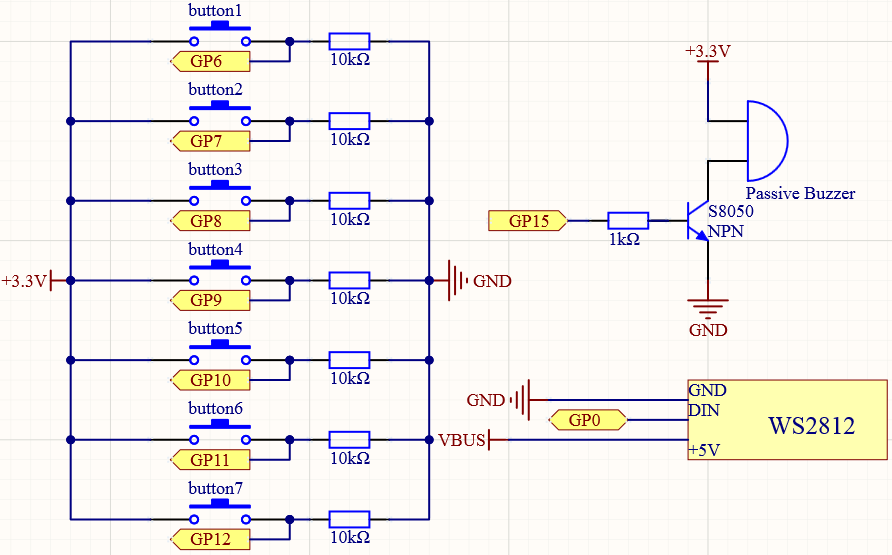
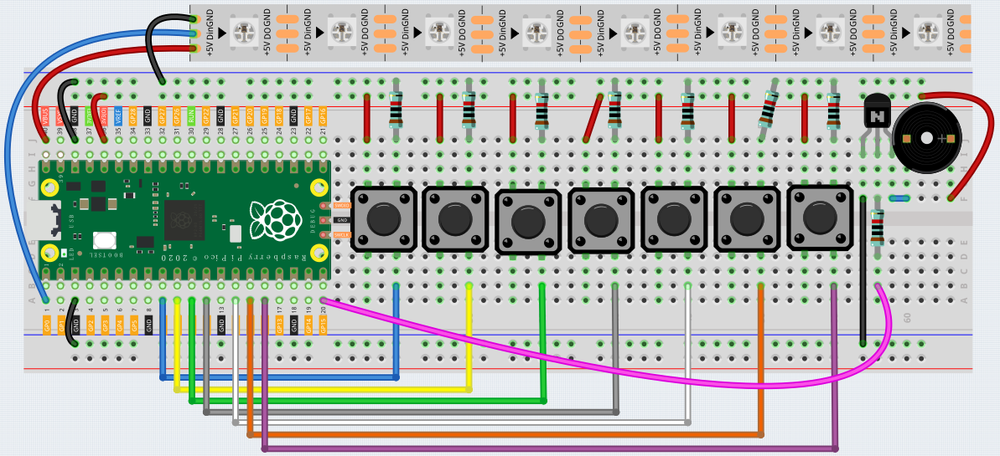

LUMI Piano
=============

In this project, we will use 7 buttons, a WS2812 Strip and a buzzer to create a LUMI Piano.

The 7 buttons respectively represent 7 notes. When the button is pressed, the passive buzzer will emit the corresponding note, and the WS2812 Strip will light up the corresponding LED.

Schematic
------------------------

Wiring
----------

Code
-------

After the program is running, press different buttons, the buzzer will emit different sounds, and the WS2812 will also light up the corresponding LEDs.

.. raw:: html

    <iframe src=https://create.arduino.cc/editor/sunfounder01/3499c404-86d5-4b59-8a22-4213dab7a204/preview?embed style="height:510px;width:100%;margin:10px 0" frameborder=0></iframe>

How it works?
---------------

.. code-block:: arduino

    const int buttonPin[] = {6, 7, 8, 9, 10, 11, 12};

    const int pitch[] = {523, 587, 659, 698, 784, 880, 988};

Store the 8 button pins in the array ``buttonPin[]`` so that they can be quickly set and used later.

``pitch[]`` stores the frequencies corresponding to C, E, E, F, G, A, B,notes in C major scale.

.. code-block:: arduino

    for (int i = 0; i <  NUMPIXELS ; i++) {
      pinMode(buttonPin[i], OUTPUT);
    }
    pixels.begin();
    pinMode(buzzerPin, OUTPUT);
    Serial.begin(9600);

Use the ``for`` loop in ``setup()`` to initialize the pins of all buttons and buzzer and set them to output mode.

.. code-block:: arduino

  for (int i = 0; i < NUMPIXELS; i++) {
    if (digitalRead(buttonPin[i]) == HIGH) {
      tone(buzzerPin, pitch[i]);
      pixels.setBrightness(100);
      pixels.setPixelColor(i, 0xFF8822);
      pixels.show();
      while (digitalRead(buttonPin[i]) == HIGH);
      fade();
      noTone(buzzerPin);
    }
  }

Create a ``for`` loop in ``loop()`` function to traverse all the buttons, sounds and pixels, and set the judgment when the button is pressed, the buzzer will sound the corresponding note, and the WS2812 will light up the corresponding LED.

.. code-block:: arduino

    void fade() {
      while (1) {
        int brightness = pixels.getBrightness();
        if (brightness <= 0) {
          return;
        }
        pixels.setBrightness(brightness -= 1);
        pixels.show();
        delay(2);
      }

The ``fade()`` function is used to slowly reduce the brightness of the LEDs on the WS2812 Strip to 0.

First get the brightness value of the currently lit LED through ``getBrightness()`` function, then write the decreasing brightness value to WS2812 Strip through ``setBrightness()`` function, and finally present the effect through ``show()`` function.

If the brightness is less than 0, then exit this function.
