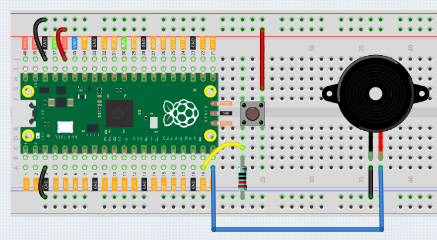

Active Buzzer
==================

In this project, we will learn how to use buttons to control the active buzzer.

Wring
----------

1. Connect the 3V3 pin of the Pico to the positive power bus of the breadboard.
#. Connect the anode lead of the buzzer to the GP15 through a jumper wire.
#. Connect the cathode lead of the buzzer to the negative power bus of the breadboard through a jumper wire.
#. Insert the button into the breadboard.
#. Use a jumper to connect one end of the button pin to the positive bus.
#. Use a jumper to connect the other pin of the button to GP14.
#. Use a 10k resistor to connect the pin of the button connected to GP14 to the negative bus.
#. Connect the negative power bus of the breadboard to the GND of Pico.
#. When you press or release the button, the circuit will switch between closed and open.

Code
---------

After clicking Start in the upper left corner, the code starts to run. The buzzer will sound when the button is pressed.

.. image:: img/pir.png
    :width: 300

.. note::
    Similar to the previous project, you can refer to :ref:`Button`