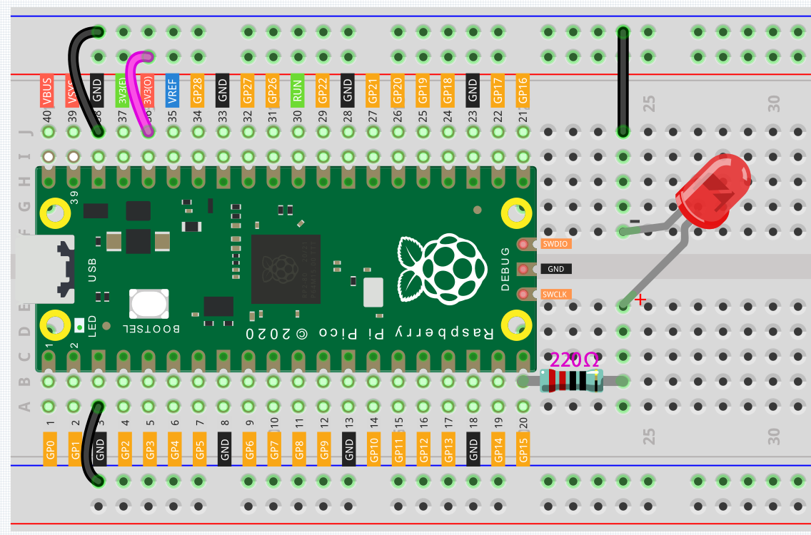
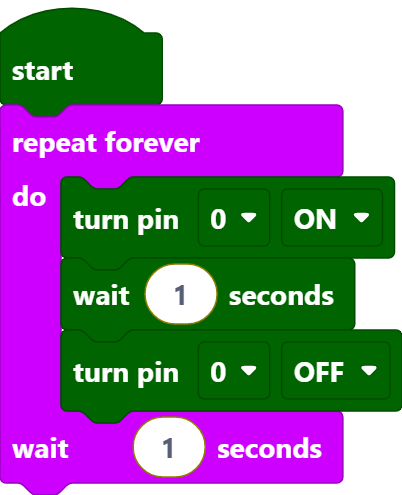

Blink LED
===============

For this project, we intend to make the extended LED light blink. To use extended electronic components, a solderless breadboard will be the most powerful partner for novice users.

The breadboard is a rectangular plastic plate with a bunch of small holes in it. These holes allow us to easily insert electronic components and build electronic circuits. The breadboard does not permanently fix the electronic components, which makes it easy for us to repair the circuit and start over when we make a mistake.

Wiring
----------

Let us follow the direction of the current to build the circuit!

1. Here we use the electrical signal from the GP15 pin of the Pico board to make the LED work, and the circuit starts from here.
#. The current needs to pass through a 220 ohm resistor (used to protect the LED). Insert one end (either end) of the resistor into the same row as the Pico GP15 pin (row 20 in my circuit), and insert the other end into the free row of the breadboard (row 24 in my circuit).

    .. note::
        The color ring of the 220 ohm resistor is red, red, black, black and brown.

#. Pick up the LED, you will see that one of its leads is longer than the other. Insert the longer lead into the same row as the end of the resistor, and connect the shorter lead across the middle gap of the breadboard to the same row.
    
    .. note::
        The longer lead is known as the anode, and represents the positive side of the circuit; the shorter lead is the cathode, and represents the negative side. 

        The anode needs to be connected to the GPIO pin through a resistor; the cathode needs to be connected to the GND pin.

#. Insert the male-to-male (M2M) jumper wire into the same row as the LED short pin, and then connect it to the negative power bus of the breadboard.
#. Use a jumper to connect the negative power bus to the GND pin of Pico.

Code
---------

After clicking Start in the upper left corner, the code starts to run.

Code explanation
-------------------

When pin0 is turned off (low level), the led will not light up, when pin0 is turned on (high level), the led will light up.
Switch the pin0 level state cyclically to make the LED blink.

* [start] this code block is the basic framework of the program and represents the beginning of the program.
* [repeat forever do...wait () seconds] means that the code block in it will be executed repeatedly, and the execution time interval is defined by yourself.
* [turn pin () ON/OFF] indicates that a certain pin is placed in a high level (ON) or a low level (OFF).
* [wait () seconds] Set the execution interval between code blocks.
