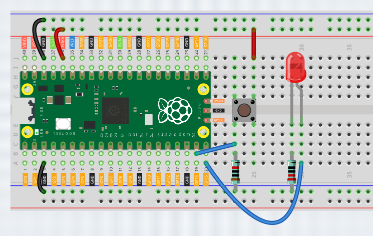

Button
==========

In this project, we will learn how to turn on or off the LED by using a button.

Wiring
---------

1. Connect the 3V3 pin of the Pico to the positive power bus of the breadboard.
#. Connect the anode lead of the LED to the GP15 through a jumper wire, and connect the cathode lead to the same row through the middle gap of the breadboard.
#. Connect the LED cathode to the negative power bus of the breadboard through a 220Ω resistor.
#. Insert the button into the breadboard.
#. Use a jumper to connect one end of the button pin to the positive bus.
#. Use a jumper to connect the other pin of the button to GP14.
#. Use a 10k resistor to connect the pin of the button connected to GP14 to the negative bus.
#. Connect the negative power bus of the breadboard to the GND of Pico.
#. When you press or release the button, the circuit will switch between closed and open.

Code
--------

After clicking Start in the upper left corner, the code starts to run. When the switch is pressed, the LED will be lit. When the switch is released, the LED will go out.

.. image:: img/slide_switch.png
    :width: 300

Code explanation
-------------------

In the loop, judge the level of GP14. When it is low, it means that the button is not pressed. At this time, turn off GP15 (low level), and the led will not light up.
When GP14 is at high level, it means that the button is pressed. At this time, turn on GP15 (high level), and the led will light up.

* [if ... do ... else ...] this code blocks represent conditional judgments.
* [is pin(14) HIGH] read the level of pin14 and judge it to be high. If it is judged to be true, it returns 1, and if it is judged to be false, it returns 0. It is often used in conjunction with the condition judgment code block.
