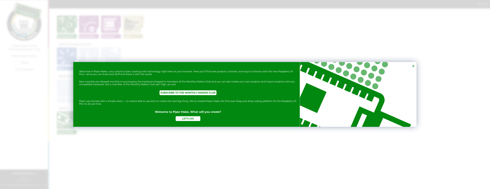
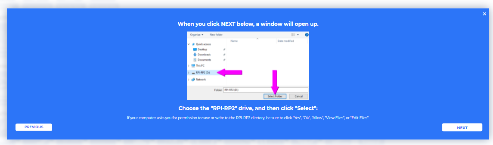
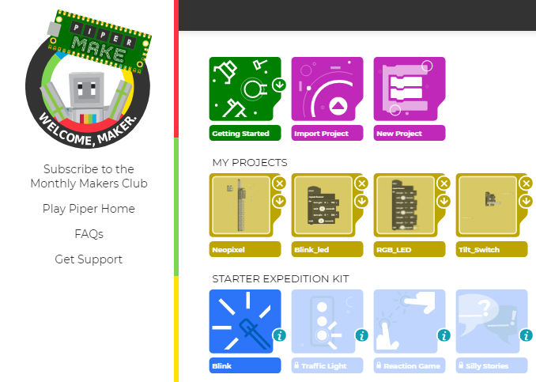
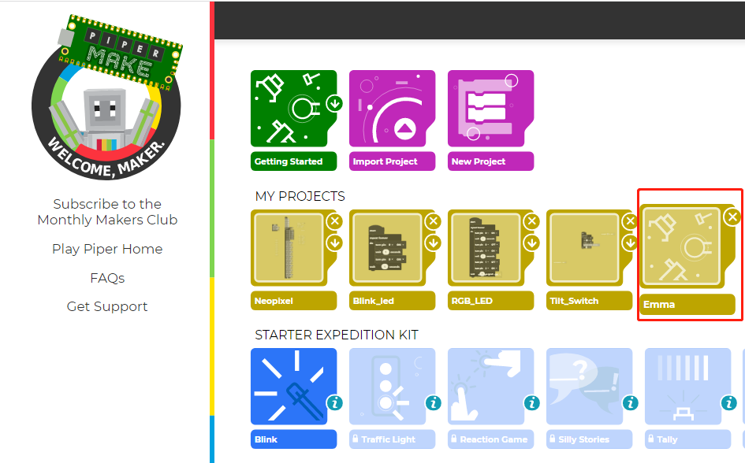

Quick Guide on Piper Make
======================================

Piper Make is a super easy and fun way to make projects using Raspberry Pi Pico. It uses blocks like Scratch, so you don't need any programming experience to use it.
The underlying principle is to use CircuitPython with auxiliary libraries.

Set up the Pico
---------------------

First, visit Piper Make through the following link：

https://make.playpiper.com/

In the pop-up page, if you don't need to subscribe for more tutorials, you can just click **Let's Go!** or the **x** button.

.. note::
    If you see a different pop-up window, your browser version is not supported, please update your browser and try again. 

Scroll to the bottom of this page and click on the **Set up my Pico** under the **Tools** section and follow the prompts to configure it.

.. image:: img/media2.png

Click **Next** to start configuring your Pico, even if you have set it up before, these are the same steps you will use to update your Pico firmware.

.. image:: img/media3.png

In this step, you need to make sure that your Pico is unplugged from your computer, as it needs to be plugged in in a specific way in the next step. Make sure your cable can handle power and data, as many micro USB cables only have power.

.. image:: img/media4.png

Now, press and hold the RST (white) button on the Pico and plug the Pico into your computer. Once plugged in, you can release the button.

.. image:: img/media5.png

Your Pico will appear as a USB drive, click **Next** after that select **RPI-RP2** drive.

.. note::
    After select **RPI-RP2** drive, there will be a pop up window at the top that you need to allow the web page to view files.

Now Piper Make will load the firmware to your Pico, again you need to allow save changes to the hard drive where the Pico is located.

When this prompt appears, it means your Pico is set up and you can start using it.

.. image:: img/media8.png

How to use Piper Make
-------------------------------

Now that you have set up Pico, it is time to learn how to program it. Now let's light up the onboard LED.

Click on the **New Project** button, and a new project will appear in the **MY PROJECTS** section and will be assigned a random name that can be changed from the programming page.

Then open the new project just created.

Now go to the Piper Make programming page.

.. image:: img/piper_intro1.png

* **START**: Used to run the code, if it's gray, it's not connected to Pico at this time.
* **Block palette**: contains different types of blocks.
* **CONNECT**: Used to connect to Pico, it is green when not connected to Pico, when connected it will become **DISCONNECT(red)**.
* **Programming Area**: Drag blocks here to finish programming by stacking them.
* **Tools Area**: You can click **DIGITAL VIEW** to see the pin distribution of Pico; you can view the print information in **CONSOLE**; you can read data from **DATA**, and you can click **Python** to view the Python source code.
* **Project name and description**: You can change the project name and description.
* **DOWNLOAD**: You can click the **DOWNLOAD** button to save it locally, usually in **.png** format. Next time you can import it via the **Import Project** button on the home page.

Click on the **Chip** palette and drag the [start] block to the **Programming Area**.

.. image:: img/media12.png

Then drag the [loop] block in **loops** palette to the bottom of the [start] block, and set the loop interval to 1 second.

.. image:: img/media14.png

The Raspberry Pi Pico's onboard LED is at pin25, so we use the [turn pin () ON/OFF] block on the **Chip** palette to control it.

.. image:: img/media15.png

Now click on the **CONNECT** button to connect to pico, after clicking on it a new popup will appear, select the recognized **CircuitPython CDC control (COMXX)** port, then click on **Connect**. When the connection is successful, the green **CONNECT** in the bottom left corner will change to a red **DISCONNECT**.

.. image:: img/media16.png

Now click on the **START** button to run this code and you will see the LED on the Pico lit up. If yours is gray, it means that the Pico is not connected, please reconnect it.

.. image:: img/media166.png

Then turn off pin25 every second in the cycle, and click **START** on the upper left again, so that you can see the onboard LED lights flashing.

.. image:: img/media17.png
