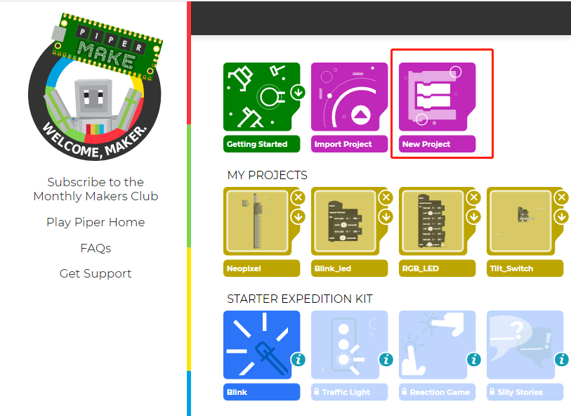

Geting Started with Piper Make
======================================

Piper Make is a super easy and fun way to make projects using Raspberry Pi Pico. It uses blocks like Scratch, so you don't need any programming experience to use it.
The underlying principle is to use CircuitPython with auxiliary libraries.

Configure Raspberry Pi Pico on Piper Make
---------------------------------------------

First, you need to visit the Piper Make website, https://make.playpiper.com/

You will see this screen. Unless you want to subscribe to access more tutorials, just click "Get started!" or the "x" button in the pop-up window.

.. image:: img/media1.png

If you see a different pop-up window stating that your browser version is not supported, please update your browser version and try again.

You should now click on the box labeled "Set up my Pico" under the "Tools" section and they will guide you through the setup. You only need to do this the first time you use Piper Make, but you might still want to do this frequently to keep the firmware up to date.
This part requires the use of a micro USB cable to plug Pi Pico into the computer. Make sure your cable can handle power and data, as many micro USB cables are only used for power supply.

.. image:: img/media2.png

It should show you this screen first. Click Next to start setting up your Pico. Even if you have set it up before, these steps are the same steps you use to update the Pico firmware.

.. image:: img/media3.png

If your Pico is plugged into your computer, please unplug it immediately and press Next.

.. image:: img/media4.png

Now, plug in your Pico, making sure to hold down the white BOOTSEL button during this process. After inserting, you can release the button.

.. image:: img/media5.png

Your Pico should appear like a USB drive. After clicking Next, select RPI-RP2 drive.

.. image:: img/media6.png

Now Piper Make will load the firmware to your Pico.

.. image:: img/media7.png

Finally, if you see this screen, your device is set up and you should be able to start using it.

.. image:: img/media8.png

Now that you have set up Pico, it is time to learn how to program it. If you have an LED and a resistor, a good start is the Blink program.

.. image:: img/media9.png

Now let's light up the onboard LED lights.

Click to create a new project.

Then open the new project just created.

.. image:: img/media11.png

Click **Chip** and drag the **start** block to the programming area on the right.

.. image:: img/media12.png

Drag the loop block in **loops** to the bottom of the **start** block, and set the loop interval to 1 second.

.. image:: img/media14.png

The pin port of the onboard led is pin25. There is a code block in the **chip** to control the level of the pin port and drag it into the loop.

.. image:: img/media15.png

Click CONNECT on the bottom left to connect to pico, and then click START on the top left to run the code, so you can see the onboard LED lights up.

.. image:: img/media16.png

Then turn off pin25 every second in the cycle, and click START on the upper left again, so that you can see the onboard LED lights flashing.

.. image:: img/media17.png
