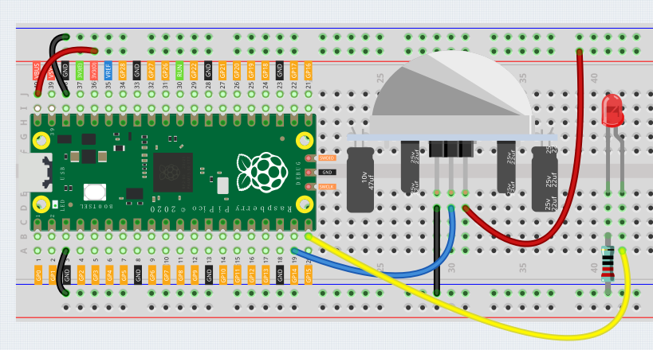

PIR
========

In this project, we will make a device by using the human body infrared pyroelectric sensors. When someone gets closer to the LED, the LED will turn on automatically. If not, the light will turn off. This infrared motion sensor is a kind of sensor that can detect the infrared emitted by human and animals.

Wiring
---------

1. Connect the 3V3 pin of the Pico to the positive power bus of the breadboard.
#. Connect the anode lead of the LED to GP15 through a jumper wire, and connect the cathode lead to the same row through the middle gap of the breadboard.
#. Connect the LED cathode to the negative power bus of the breadboard through a 220Ω resistor.
#. Insert pir into the breadboard.
#. Use a jumper to connect the anode pin of the pir to the positive bus.
#. Use jumpers to connect the middle pin of pir to GP14.
#. Use a jumper to connect the cathode pin of the pir to the negative bus.
#. Connect the negative power bus of the breadboard to the GND of Pico.

Code
---------

After clicking Start in the upper left corner, the code starts to run. When an object passes through the PIR, the LED light will light up.

.. image:: img/pir.png
    :width: 300

.. note::
    Similar to the previous project, you can refer to :ref:`Button`    