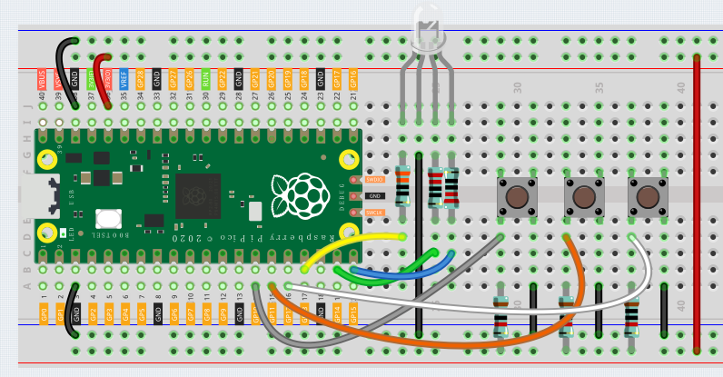
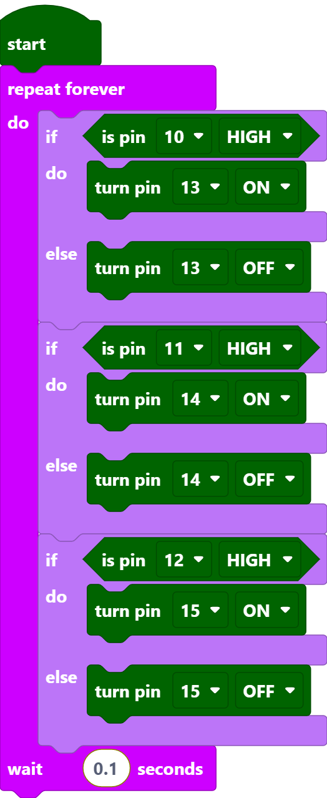

RGB LED
============

In this project, we will learn how to use piper make to light up the RGB LED.

RGB LED is equivalent to encapsulating Red LED, Green LED, Blue LED under one lamp cap, and the three LEDs share one cathode pin. Since the electric signal is provided for each anode pin, the light of the corresponding color can be displayed. By changing the electrical signal intensity of each anode, it can be made to produce various colors.

Wiring
----------

Put the RGB LED flat on the table, we can see that it has 4 leads of different lengths.
Find the longest one (GND) and turn it sideways to the left.
Now, the order of the four leads is Red, GND, Green, Blue from left to right.

.. image:: ../img/rgb_pin.jpg
    :width: 200

1. Connect the GND pin of the Pico to the negative power bus of the breadboard.
#. Insert the RGB LED into the breadboard so that its four pins are in different rows.
#. Connect the red lead to the GP13 pin via a 330Ω resistor. When using the same power supply intensity, the Red LED will be brighter than the other two, and a slightly larger resistor needs to be used to reduce its brightness.
#. Connect the Green lead to the GP14 pin via a 220Ω resistor.
#. Connect the Blue lead to the GP15 pin via a 220Ω resistor.
#. Connect the GND lead to the negative power bus.
#. Connect the negative power bus to Pico's GND.

.. note::
    * The color ring of the 220Ω resistor is red, red, black, black and brown.
    * The color ring of the 330Ω resistor is orange, orange, black, black and brown.

Code
---------

After clicking Start, the code starts to run. Press different buttons, the led will emit light of different colors, you can also press multiple buttons at the same time to make the led emit more combined colors of light.

Code explanation
-------------------

You can think of this project as using three buttons to control three leds, and set three if judgment conditions to judge whether the three buttons are pressed or not.

When the button is pressed, the level of the corresponding pin is pulled up to make the RGB LED show different colors of light.
