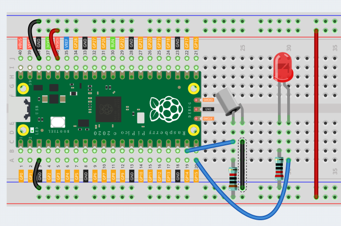

Tilt Switch
==================

This is a ball tilt-switch with a metal ball inside. It is used to detect inclinations of a small angle.

**Wiring**

* The tilt switch has an iron ball inside, when you put it upright, the iron ball falls down, which can make the 2 pins connected together; tilt it to a horizontal angle, the iron ball rolls towards the end, so the 2 pins of the tilt switch are disconnected.

* Again, you need to connect 10K pull-up resistor to get a stable level.

**Code**

After connecting Pico, click the **Start** button and the code starts to run. When the tilt switch is placed horizontally, the LED will turn off; and when placed vertically, the LED will light up.

.. image:: img/slide_switch.png
    :width: 300

.. note::
    This project code is exactly the same as the previous project :ref:`Button`.