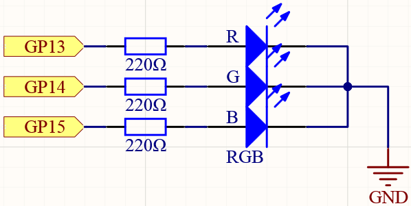
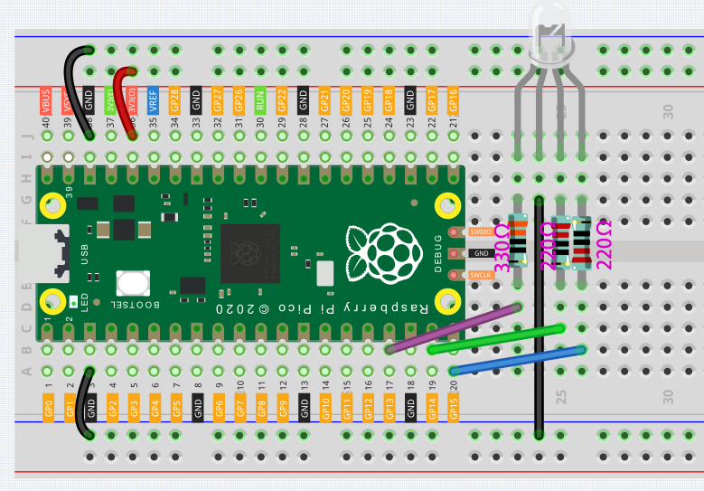

.. _rgb_led_arduino:

RGB LED
=========

As we know, light can be superimposed. For example, mix blue light and green light give cyan light, red light and green light give yellow light.
This is called "The additive method of color mixing".

* `Additive color - Wikipedia <https://en.wikipedia.org/wiki/Additive_color>`_

Based on this method, we can use the three primary colors to mix the visible light of any color according to different specific gravity. For example, orange can be produced by more red and less green.

In this chapter, we will use RGB LED to explore the mystery of additive color mixing!

RGB LED is equivalent to encapsulating Red LED, Green LED, Blue LED under one lamp cap, and the three LEDs share one cathode pin.
Since the electric signal is provided for each anode pin, the light of the corresponding color can be displayed. By changing the electrical signal intensity of each anode, it can be made to produce various colors.

Schematic
-----------

Wiring
-----------------------------------------------

Put the RGB LED flat on the table, we can see that it has 4 leads of different lengths.
Find the longest one (GND) and turn it sideways to the left.
Now, the order of the four leads is Red, GND, Green, Blue from left to right.

.. image:: img/rgb_pin.jpg
    :width: 200

1. Connect the GND pin of the Pico to the negative power bus of the breadboard.
#. Insert the RGB LED into the breadboard so that its four pins are in different rows.
#. Connect the red lead to the GP13 pin via a 330Ω resistor. When using the same power supply intensity, the Red LED will be brighter than the other two, and a slightly larger resistor needs to be used to reduce its brightness.
#. Connect the Green lead to the GP14 pin via a 220Ω resistor.
#. Connect the Blue lead to the GP15 pin via a 220Ω resistor.
#. Connect the GND lead to the negative power bus.
#. Connect the negative power bus to Pico's GND.

.. note::
    * The color ring of the 220Ω resistor is red, red, black, black and brown.
    * The color ring of the 330Ω resistor is orange, orange, black, black and brown.

Code
-------

Here, we can choose our favorite color in drawing software and display it with RGB LED.

.. raw:: html

    <iframe src=https://create.arduino.cc/editor/sunfounder01/8a827cd8-e585-41c5-97bf-bfc24acf42a7/preview?embed style="height:510px;width:100%;margin:10px 0" frameborder=0></iframe>

.. image:: img/edit_colors.png

Write the RGB value into color(), you will be able to see the RGB light up the colors you want.

How it works?
----------------

.. code-block:: Arduino

    void color (unsigned char red, unsigned char green, unsigned char blue)// the color generating function  
    {    
        analogWrite(redPin, red);   
        analogWrite(greenPin, green); 
        analogWrite(bluePin, blue); 
    }

We defined a ``color()`` function to let the three primary colors work together.

At present, pixels in computer hardware usually adopt a 24-bit representation method. The three primary colors are divided into 8 bits, and the color value range is 0 to 255. With 256 possible values for each of the three primary colors (don't forget to count 0!), that 256 x 256 x 256 = 16,777,216 colors can be combined in this way.
The ``color()`` function also follows the 24-bit notation, which makes it easier for us to select the desired color.

``analogWrite(pin, value)`` Writes an analog value (PWM wave) to a pin. Can be used to light a LED at varying brightnesses or drive a motor at various speeds. After a call to ``analogWrite()``, the pin will generate a steady rectangular wave of the specified duty cycle until the next call to analogWrite() (or a call to digitalRead() or digitalWrite()) on the same pin.

    ``pin``: the Arduino pin to write to. Allowed data types: int.

    ``value``: the duty cycle: between 0 (always off) and 255 (always on). Allowed data types: int.

* `analogWrite(pin, value) <https://www.arduino.cc/reference/en/language/functions/analog-io/analogwrite/>`_
