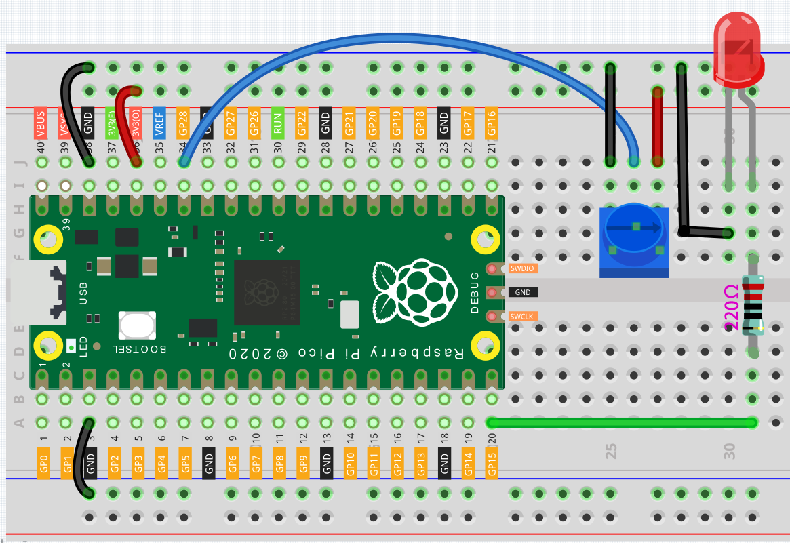

Table Lamp
============

In the previous projects, we have used the digital input on the Pico.
For example, a button can change the pin from low level (off) to high level (on). This is a binary working state.

However, Pico can receive another type of input signal: analog input.
It can be in any state from fully closed to fully open, and has a range of possible values.
The analog input allows the microcontroller to sense the light intensity, sound intensity, temperature, humidity, etc. of the physical world.

Usually, a microcontroller needs an additional hardware to implement analog input-the analogue-to-digital converter (ADC).
But Pico itself has a built-in ADC for us to use directly.

.. image:: img/pin_pic3.png

Pico has three GPIO pins that can use analog input, GP26, GP27, GP28. That is, analog channels 0, 1, and 2.
In addition, there is a fourth analog channel, which is connected to the built-in temperature sensor and will not be introduced here.

In this project, we try to read the analog value of potentiometer.

Schematic
-----------

.. image:: img/Table_Lamp.png

Wiring
-------------------------

#. Connect 3V3 and GND of Pico to the power bus of the breadboard.
#. Insert the potentiometer into the breadboard, its three pins should be in different rows.
#. Use jumper wires to connect the pins on both sides of the potentiometer to the positive and negative power bus respectively.
#. Connect the middle pin of the potentiometer to GP28 with a jumper wire.
#. Connect the anode of the LED to the GP15 pin through a 220Ω resistor, and connect the cathode to the negative power bus.

Code
----------

Once the code has been successfully uploaded, open Serial Monitor and then ensure that baudrate is 9600, rotate the potentiometer in 2 directions and you will see that the value range is 0-1023.

When the displayed value is 0, the LED goes off and as the value increases, the LED gets brighter.

.. image:: img/table_lamp_serial.png
    :width: 600

.. note::
    If your code is OK and you have selected the correct board and port, but the upload is still not successful.

    At this point you can click on the **Upload** icon again when the progress below shows "Upload...", unplug the USB cable again and plug it in and the code will be uploaded successfully.

.. raw:: html

    <iframe src=https://create.arduino.cc/editor/sunfounder01/defb79fe-bdf8-45d9-8774-1996d05efd63/preview?embed style="height:510px;width:100%;margin:10px 0" frameborder=0></iframe>

How it works?
---------------

To enable Serial Monitor, you need to start serial communication in ``setup()`` and set the datarate to 9600.

.. code-block:: arduino
    :emphasize-lines: 3

    void setup() {
        pinMode(ledPin, OUTPUT);
        Serial.begin(9600);
    }

    
* `Serial <https://www.arduino.cc/reference/en/language/functions/communication/serial/>`_

In the loop function, the value of the potentiometer is read, then the value is mapped from 0-1023 to 0-255 and finally the value after the mapping is used to control the brightness of the LED.

.. code-block:: arduino

    void loop() {
        int sensorValue = analogRead(sensorPin);
        Serial.println(sensorValue);
        int brightness = map(sensorValue, 0, 1023, 0, 255);
        analogWrite(ledPin, brightness);
    }

* `analogRead() <https://www.arduino.cc/reference/en/language/functions/analog-io/analogread/>`_ is used to read the value of the sensorPin (potentiometer) and assigns it to the variable ``sensorValue``.

.. code-block:: arduino

    int sensorValue = analogRead(sensorPin);

* Print the value of SensorValue in Serial Monitor.

.. code-block:: arduino

    Serial.println(sensorValue);

* Here, the `map(value, fromLow, fromHigh, toLow, toHigh) <https://www.arduino.cc/reference/en/language/functions/analog-io/analogread/>`_ function is required as the potentiometer value read is in the range 0-1023 and the value of a PWM pin is in the range 0-255. It is used to Re-maps a number from one range to another. That is, a value of fromLow would get mapped to toLow, a value of fromHigh to toHigh, values in-between to values in-between, etc.

.. code-block:: arduino

    int brightness = map(sensorValue, 0, 1023, 0, 255);

* Now we can use this value to control the brightness of the LED.

.. code-block:: arduino

    analogWrite(ledPin,brightness);

