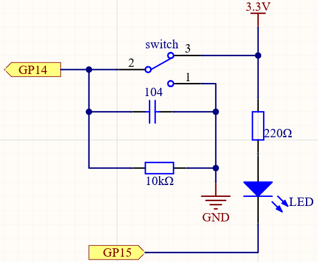

Warning Light
===============

From the name of GPIO (General-purpose input/output), we can see that these pins have both input and output functions. In the previous two projects we used the output function, 
in this project, we will use the input function to input the Slide value, and then control the LED to blink, like a warning light.

Schematic
----------------

Wiring
-------------------------

.. image:: img/warning_light.png

1. Connect the 3V3 pin of Pico to the positive power bus of the breadboard.
#. Connect one end (either end) of the 220 ohm resistor to GP15, and insert the other end into the free row of the breadboard.
#. Insert the anode lead of the LED into the same row as the end of the 220Ω resistor, and connect the cathode lead across the middle gap of the breadboard to the same row.
#. Connect the LED cathode to the negative power bus of the breadboard.
#. Insert the slide switch into the breadboard.
#. Use a jumper wire to connect one end of slide switch pin to the negative bus.
#. Connect the middle pin to GP14 with a jumper wire.
#. Use a jumper wire to connect last end of slide switch pin to the positive bus
#. Use a 10K resistor to connect the middle pin of the slide switch and the negative bus.
#. Use a 104 capacitor to connect the middle pin of the slide switch and the negative bus to realize debounce that may arise from your toggle of switch.
#. Connect the negative power bus of the breadboard to Pico's GND.

When you toggle the slide switch, the circuit will switch between closed and open.

* :ref:`Slide Switch`

* :ref:`Capacitor`

Code
----------

After the code has run, toggle the Slide switch to one side and the LED will flash. Toggle to the other side and the LED will go out.

.. raw:: html

    <iframe src=https://create.arduino.cc/editor/sunfounder01/22da27d0-0e01-45b9-8fe3-b404d200d45c/preview?embed style="height:510px;width:100%;margin:10px 0" frameborder=0></iframe>

How it works?
-----------------

For switchs, we need to set their mode to ``INPUT`` in order to be able to get their values.

.. code-block:: arduino
    :emphasize-lines: 5

    void setup() {
        // initialize the LED pin as an output:
        pinMode(ledPin, OUTPUT);
        // initialize the switch pin as an input:
        pinMode(switchPin, INPUT);
    }
    
Read the status of the ``switchPin`` in loop() and assign it to the variable ``switchState``.

.. code-block:: arduino

    switchState = digitalRead(switchPin);
    
* `digitalRead() <https://www.arduino.cc/reference/en/language/functions/digital-io/digitalread/>`_

If the ``switchState`` is HIGH, the LED will flash.

.. code-block:: arduino

    if (switchState == HIGH) 
    {
        // turn LED on:
        digitalWrite(ledPin, HIGH);
        delay(1000);
        digitalWrite(ledPin, LOW);
        delay(1000);
    }

Otherwise, turn off the LED.

.. code-block:: arduino

    else 
    {
        digitalWrite(ledPin, LOW);
    }